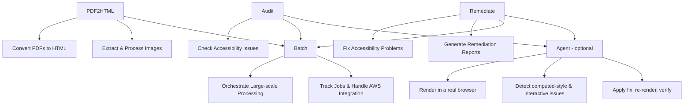
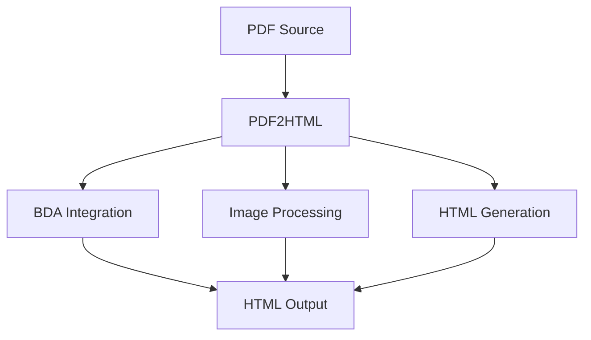
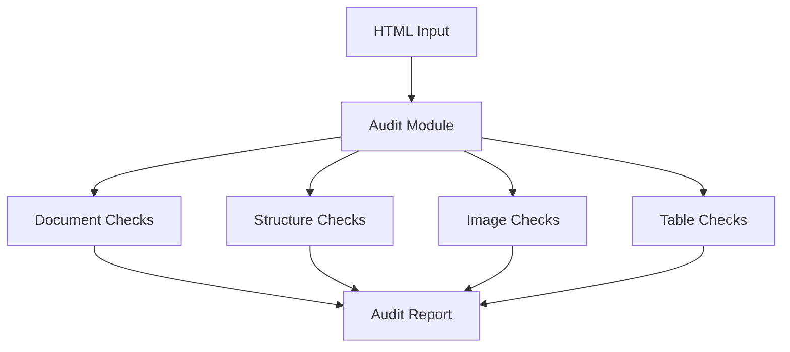
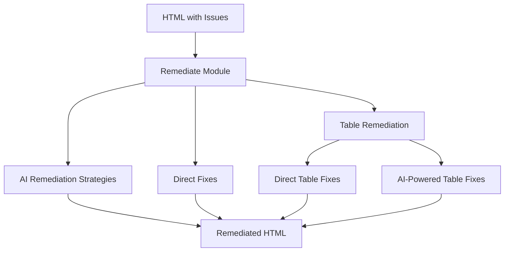
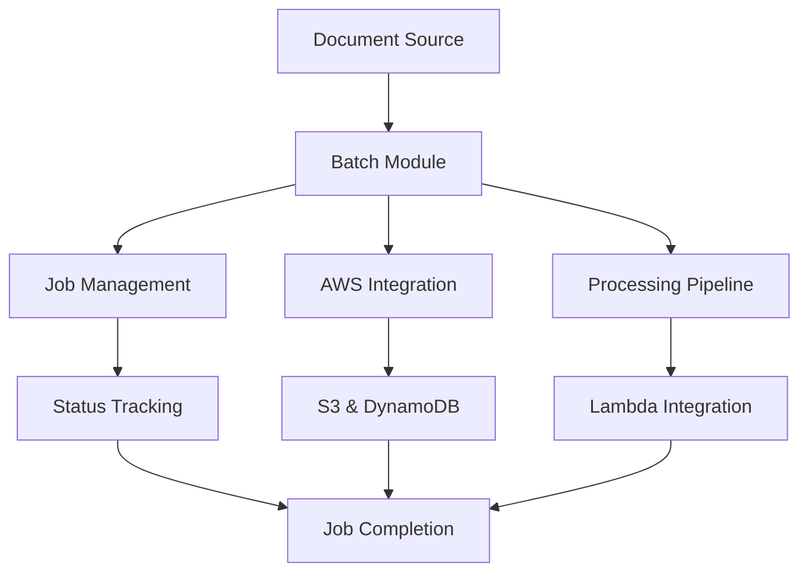

<!--
 Copyright 2025 Amazon.com, Inc. or its affiliates.
 SPDX-License-Identifier: Apache-2.0
-->

# Content Accessibility Utility on AWS

Digital content stakeholders across industries aim to streamline how they meet accessibility compliance standards efficiently. The “Content Accessibility Utility on AWS” offers a comprehensive solution for modernizing web content accessibility with state-of-the-art Generative AI models, powered by Amazon Bedrock. “Content Accessibility Utility on AWS” allows users to automatically audit and remediate WCAG 2.1 accessibility compliance issues. To get started, the solution offers a Python CLI and API. Capabilities currently include batch processing capabilities for handling large volumes of content efficiently, usage tracking to enable detailed cost management, and will continue to expand capabilities to support other content type and modals.

## Table of Contents
- [Features](#features)
- [Prerequisites](#prerequisites)
- [Installation](#installation)
- [Configuration](#configuration)
- [Architecture](#architecture)
- [Core Packages](#core-packages)
  - [PDF2HTML](#pdf2html)
  - [Audit](#audit)
  - [Remediate](#remediate)
  - [Batch](#batch)
- [Command Line Interface](#command-line-interface)
- [Python API](#python-api)
- [Requirements](#requirements)
- [License](#license)

## Features

- Convert PDF documents to accessible HTML
- Preserve layout and visual appearance
- Extract and embed images
- Audit HTML for WCAG 2.1 and 2.2 accessibility compliance
- Remediate common accessibility issues using Bedrock models
- Advanced table remediation strategies
- Optional **browser-backed (rendered) audit** that detects computed-style and
  interactive issues static HTML analysis cannot see (e.g. focus visibility),
  using a real headless browser and [axe-core](https://github.com/dequelabs/axe-core)
- Optional **accessibility agent** ([Strands](https://strandsagents.com)) that
  drives a render &rarr; fix &rarr; **verify** loop, confirming each fix actually
  renders correctly before marking it resolved
- Support for single-page and multi-page output formats
- Batch processing capabilities for large-scale document processing
- Detailed usage tracking for BDA pages and Bedrock tokens
- Cost analysis tools for resource usage monitoring
- Streamlit sample web interface with usage visualization

## Prerequisites

Before using the Content Accessibility with AWS tool, ensure the following prerequisites are met:

1. **AWS Account**: You need an AWS account with appropriate permissions.
2. **S3 Bucket**: Create an S3 bucket for storing input files, intermediate results, and outputs.
   ```bash
   aws s3 mb s3://my-accessibility-bucket
   ```
3. **BDA Project**: Set up an AWS Bedrock Data Automation (BDA) project.
   ```bash
   aws bedrock-data-automation create-data-automation-project \
       --project-name my-accessibility-project \
       --standard-output-configuration '{"document": {"extraction": {"granularity": {"types": ["DOCUMENT", "PAGE", "ELEMENT"]},"boundingBox": {"state": "ENABLED"}},"generativeField": {"state": "DISABLED"},"outputFormat": {"textFormat": {"types": ["HTML"]},"additionalFileFormat": {"state": "ENABLED"}}}}'
   ```

   Note the `projectArn` from the output, as it will be required for processing.

4. **AWS CLI Configuration**: Configure AWS credentials and default region.
   ```bash
   aws configure
   ```

## Installation

```bash
# From PyPI
pip install content-accessibility-utility-on-aws

# From source
pip install .

```

### Optional extras

The core install is static-only (no browser). The browser-backed audit and the
accessibility agent are opt-in extras so the base dependency footprint stays
small:

```bash
# Rendered audit: detect computed-style / interactive issues in a real browser
pip install "content-accessibility-utility-on-aws[rendered]"

# Agent: the render -> fix -> verify loop (implies the rendered layer)
pip install "content-accessibility-utility-on-aws[agent]"
```

Both extras use a headless browser via [Playwright](https://playwright.dev/python/).
After installing either extra, download the browser binary once:

```bash
playwright install chromium
```

> The core package never imports the browser or agent stack, so existing
> static-only workflows are unaffected. When an extra is not installed, the
> `--rendered`/`--agent` options log a warning and fall back to the static audit.
> For running the rendered layer in AWS **without bundling a browser**, see the
> [Rendered & Agent Guide](docs/rendered_agent_guide.md) (Amazon Bedrock
> AgentCore Browser Tool).

### Deploy the managed pipeline (pip only, no repo checkout)

A complete event-driven pipeline — **upload a document to S3 → convert (PDF) →
audit → agent-remediate → accessible result written back to S3** — ships with the
package. Scaffold the deployment files and deploy them; no clone required:

```bash
pip install "content-accessibility-utility-on-aws[agent]"
pip install bedrock-agentcore-starter-toolkit aws-sam-cli

# One interactive command scaffolds the files and runs the whole deploy —
# agentcore configure -> launch -> sam deploy — prompting for region, bucket,
# and (for the PDF path) BDA config, and wiring the runtime ARN between steps
# for you. Each cloud step is confirmed; add --yes for CI, --dry-run to preview.
content-accessibility-utility-on-aws deploy-pipeline
```

<details>
<summary>Prefer to run the steps yourself?</summary>

```bash
# Write the SAM template, AgentCore runtime app, and trigger Lambda into a dir:
content-accessibility-utility-on-aws init-pipeline ./a11y-pipeline
cd a11y-pipeline

agentcore configure --entrypoint agentcore_app.py --name a11y_pipeline \
  --requirements-file requirements.txt --region <region>
# For the PDF path, pass BDA config as runtime env vars; note the runtime ARN.
agentcore launch --env BDA_S3_BUCKET=<bucket> --env BDA_PROJECT_ARN=<bda-project-arn>
sam deploy --guided --parameter-overrides \
  AgentRuntimeArn=<runtime-arn> InputBucketName=<globally-unique-bucket>
```

</details>

Then upload documents to the input bucket (`pdf/` for PDFs, `html/` for HTML or a
`.zip` of HTML+CSS+JS); results land under `accessible/`. The generated
`README.md` and the [Rendered & Agent Guide](docs/rendered_agent_guide.md) cover
IAM, BDA setup, and usage in full.

## Configuration

### Environment Variables

Set the following environment variables to configure the tool:

```bash
export BDA_S3_BUCKET=my-accessibility-bucket
export BDA_PROJECT_ARN=arn:aws:bedrock:us-west-2:123456789012:project/my-accessibility-project
```

Optional environment variables:
- `AWS_PROFILE`: Specify an AWS CLI profile to use.
- `CONTENT_ACCESSIBILITY_WORK_DIR`: Directory for temporary files (default: system temp).

### Example Configuration File

The tool supports configuration files for easier setup. Below is an example configuration file (`my-config.yaml`):

```yaml
# PDF conversion settings
pdf:
  extract_images: true
  image_format: png
  embed_images: false
  single_file: true
  continuous: true
  embed_fonts: false
  exclude_images: false
  cleanup_bda_output: false

# Accessibility audit settings
audit:
  audit_accessibility: true
  min_severity: minor
  detailed_context: true
  skip_automated_checks: false
  issue_types: null  # Set to a list of specific issue types or null for all

# Remediation settings
remediate:
  max_issues: 100
  model_id: us.anthropic.claude-sonnet-5
  issue_types: null
  severity_threshold: minor
  report_format: json

# AWS settings
aws:
  # To use an existing BDA project:
  create_bda_project: false
  bda_project_arn: "arn:aws:bedrock:us-west-2:123456789012:project/my-accessibility-project"
  
  # OR to create a new BDA project:
  # create_bda_project: true
  # bda_project_name: "my-new-accessibility-project"
  
  s3_bucket: my-accessibility-bucket
```

## Architecture

The package consists of four main modules working together to convert, audit, remediate, and batch process documents, plus an optional browser-backed **agent** layer on top:



The optional agent layer (`agent/`) renders pages in a real headless browser to
find issues static analysis cannot (computed contrast, focus visibility, the
accessibility tree) and closes the loop by re-rendering to **verify** each fix.
It is fully additive and off by default. See the
[Rendered & Agent Guide](docs/rendered_agent_guide.md).

## Core Packages

### PDF2HTML

The PDF2HTML module handles conversion of PDF documents to HTML, including image extraction and processing.



Key components:
- Bedrock Data Automation (BDA) integration for PDF parsing
- Image extraction and processing
- HTML structure generation with preserved layout
- Support for both single-page and multi-page output

### Audit

The Audit module analyzes HTML for accessibility issues according to WCAG 2.1 and 2.2 guidelines.



Key components:
- Comprehensive accessibility checks
- Issue severity classification
- Detailed context information
- Multiple report formats (HTML, JSON, text)

> **WCAG 2.2 scope:** Because this tool produces static HTML converted from PDFs,
> it audits and remediates the WCAG 2.2 criteria that apply to non-interactive
> documents — currently **2.5.8 Target Size (Minimum)**. The remaining 2.2
> criteria (2.5.7 Dragging Movements, 3.2.6 Consistent Help, 3.3.7 Redundant
> Entry, 3.3.8 Accessible Authentication) govern interactive web-application
> behaviors such as drag gestures, multi-page help, and authentication flows,
> which are out of scope for generated document content.

### Remediate

The Remediate module fixes accessibility issues identified during audit.



Key components:
- AI-powered remediation using Bedrock models
- Direct fixes for common issues
- Advanced table structure remediation
- Image accessibility enhancements
- Remediation reporting

### Batch

The Batch module provides orchestration for processing documents at scale.



Key components:
- AWS service integrations
- Job tracking and status management
- Asynchronous processing
- Lambda function support

## Command Line Interface

The package provides a command-line interface with several subcommands:

### PDF to HTML Conversion

```bash
content-accessibility-utility-on-aws convert --input path/to/document.pdf --output output/directory
```

Options:
- `--single-file`: Generate a single output file
- `--single-page`: Combine all pages into a single HTML document
- `--multi-page`: Keep pages as separate HTML files
- `--extract-images`: Extract and include images from the PDF (default: True)
- `--image-format [png|jpg|webp]`: Format for extracted images
- `--embed-images`: Embed images as data URIs in HTML
- `--s3-bucket`: Name of an existing S3 bucket to use
- `--bda-project-arn`: ARN of an existing BDA project to use
- `--create-bda-project`: Create a new BDA project if needed
- `--config`: Path to configuration file

### Accessibility Audit

```bash
content-accessibility-utility-on-aws audit --input path/to/document.html --output accessibility-report.json --format json
```

For HTML report:

```bash
content-accessibility-utility-on-aws audit --input path/to/document.html --output accessibility-report.html --format html
```

To additionally run the browser-backed (rendered) audit, which detects
computed-style and interactive issues (e.g. focus visibility) the static audit
cannot see:

```bash
content-accessibility-utility-on-aws audit --input path/to/document.html --output report.json --rendered
```

Options:
- `--format`, `-f [json|html|text]`: Output format for audit report
- `--checks`: Comma-separated list of checks to run
- `--severity [minor|major|critical]`: Minimum severity level to include in report
- `--detailed`: Include detailed context information in report (default: True)
- `--summary-only`: Only include summary information in report
- `--rendered`: Also render each page in a headless browser to detect
  computed-style/interactive issues static analysis misses (requires the
  `[rendered]` extra and `playwright install chromium`)
- `--agent`: Use the browser-backed agent for the rendered pass (implies
  `--rendered`; requires the `[agent]` extra)
- `--config`: Path to configuration file

### Remediation

```bash
content-accessibility-utility-on-aws remediate --input path/to/document.html --output remediated.html
```

Options:
- `--auto-fix`: Automatically fix issues where possible
- `--max-issues`: Maximum number of issues to remediate
- `--model-id`: Bedrock model ID to use for remediation
- `--severity-threshold [minor|major|critical]`: Minimum severity level to remediate
- `--audit-report`: Path to audit report JSON file to use for remediation
- `--single-page`: Combine all pages into a single HTML document
- `--multi-page`: Keep pages as separate HTML files 
- `--generate-report`: Generate a remediation report after remediation (default: True)
- `--report-format [html|json|text]`: Format for the remediation report
- `--config`: Path to configuration file

### Complete Processing

```bash
content-accessibility-utility-on-aws process --input path/to/document.pdf --output output/directory
```

This command runs the full workflow:
1. Converts PDF to HTML
2. Audits the HTML for accessibility issues
3. Remediates the issues found

Options:
- `--skip-audit`: Skip the audit step
- `--skip-remediation`: Skip the remediation step
- `--audit-format [json|html|text]`: Format for the audit report
- `--severity [minor|major|critical]`: Minimum severity level for audit and remediation
- `--auto-fix`: Automatically fix issues where possible
- `--rendered`: Include the browser-backed rendered audit (see Audit above)
- `--agent`: Use the browser-backed agent for the rendered pass (implies `--rendered`)
- Plus all options available in the individual commands
- `--config`: Path to configuration file

### Scaffold the managed cloud pipeline

```bash
content-accessibility-utility-on-aws init-pipeline ./a11y-pipeline
```

Writes the deployment files (SAM template, AgentCore runtime app, trigger Lambda,
requirements) into the given directory so you can deploy the event-driven S3
pipeline without checking out the repository. See
[Deploy the managed pipeline](#deploy-the-managed-pipeline-pip-only-no-repo-checkout).

Options:
- `--force`: Overwrite existing files in the target directory

### Deploy the managed cloud pipeline (interactive)

```bash
content-accessibility-utility-on-aws deploy-pipeline
```

Scaffolds the files and runs the whole deploy — `agentcore configure` →
`agentcore launch` → `sam deploy` — prompting for values and wiring the runtime
ARN between steps. Requires the `agentcore` and `sam` CLIs on PATH.

Options:
- `--region`, `--input-bucket`, `--bda-bucket`, `--bda-project-arn`: set values
  non-interactively (anything omitted is prompted for)
- `--runtime-name`: AgentCore runtime name (default `a11y_pipeline`)
- `--yes` / `-y`: unattended (CI) — skips the per-step confirmations and runs
  `sam deploy` non-interactively (explicit flags instead of `--guided`)
- `--dry-run`: print the exact commands and exit without running anything
- `--force`: overwrite existing scaffold files

### Use a configuration file

```bash
content-accessibility-utility-on-aws convert --config my-config.yaml --input document.pdf
```

### Override config file settings with command-line arguments

```bash
content-accessibility-utility-on-aws audit --config my-config.yaml --severity major --input document.html
```

## Common Options

These options are available for all commands:

- `--input`, `-i`: Input file or directory path (required)
- `--output`, `-o`: Output file or directory path (defaults to a path based on input name)
- `--debug`: Enable debug logging
- `--quiet`, `-q`: Only output reports, suppress other output
- `--config`, `-c`: Path to configuration file
- `--profile`: AWS profile name to use for credentials

## Output Structure

### Convert Command Output

```
output-directory/
├── extracted_html/              # Directory with HTML files
│   ├── document.html            # Combined HTML file (if --single-file)
│   ├── page-0.html              # Individual page files (if not --single-file)
│   ├── page-1.html
│   └── ...
└── images/                      # Directory with extracted images
    ├── image-0.png
    ├── image-1.png
    └── ...
```

### Process Command Output

```
output-directory/
├── html/                        # Directory with HTML files
├── images/                      # Directory with extracted images
├── audit_report.[json|html|txt] # Audit report
└── remediated_document.html     # Final remediated HTML file
```

## Streamlit Sample Web Interface
A sample Streamlit web interface has been developed to demonstrate the functionality of the Document Accessibility tool. This interface allows users to upload documents, configure processing options, and view results interactively.
To learn more about the Streamlit interface, refer to the [Streamlit Guide](docs/streamlit_guide.md).

## Python API

The package provides a Python API for programmatic use:

### Complete Processing Pipeline

```python
from content_accessibility_utility_on_aws.api import process_pdf_accessibility

# Process a PDF through the full pipeline
result = process_pdf_accessibility(
    pdf_path="document.pdf",
    output_dir="output/",
    conversion_options={
        "single_file": True,
        "image_format": "png"
    },
    audit_options={
        "severity_threshold": "minor",
        "detailed": True
    },
    remediation_options={
        "model_id": "us.anthropic.claude-sonnet-5",
        "auto_fix": True
    },
    perform_audit=True,
    perform_remediation=True
)
```

### Individual Components

```python
from content_accessibility_utility_on_aws.api import (
    convert_pdf_to_html,
    audit_html_accessibility,
    remediate_html_accessibility
)

# Convert PDF to HTML
conversion_result = convert_pdf_to_html(
    pdf_path="document.pdf",
    output_dir="output/",
    options={
        "single_file": True,
        "image_format": "png"
    }
)

# Audit HTML for accessibility issues
audit_result = audit_html_accessibility(
    html_path="output/document.html",
    options={
        "severity_threshold": "minor",
        "detailed_context": True
    }
)

# Remediate accessibility issues
remediation_result = remediate_html_accessibility(
    html_path="output/document.html",
    audit_report=audit_result,
    options={
        "model_id": "us.anthropic.claude-sonnet-5",
        "auto_fix": True
    }
)
```

### Browser-backed (rendered) audit and agent

The rendered layer is enabled through the same `audit_html_accessibility` API by
setting `options["rendered"]` (or `options["agent"]`). Rendered findings use the
identical issue shape as the static audit, so the returned report and any
downstream remediation work unchanged. Requires the `[rendered]`/`[agent]`
extra and `playwright install chromium`.

```python
from content_accessibility_utility_on_aws.api import audit_html_accessibility

# Static audit + rendered pass (adds e.g. focus-visible findings)
audit_result = audit_html_accessibility(
    html_path="output/document.html",
    options={"rendered": True},
    output_path="report.json",
)
```

To drive the full render &rarr; fix &rarr; **verify** loop directly with the
Strands agent (returns the remediated HTML, the committed resolutions, and the
agent's tool-call trace):

```python
from content_accessibility_utility_on_aws.agent.browser_probe import make_browser_probe
from content_accessibility_utility_on_aws.agent.agent import run_agent

with open("output/document.html") as f:
    html = f.read()

# make_browser_probe() selects the browser backend from options/env:
#   local Playwright Chromium by default, or the managed AgentCore browser
#   when options["browser_backend"] == "agentcore" (see the guide below).
with make_browser_probe() as probe:
    result = run_agent(probe, html)

print(result["resolved"])   # issues confirmed fixed by a passing verify()
print(result["tool_log"])   # the agent's render/apply_fix/verify/commit trace
```

See the [Rendered & Agent Guide](docs/rendered_agent_guide.md) for the
architecture, the verify-before-commit guarantee, and cloud deployment on Amazon
Bedrock AgentCore.

### Batch Processing

The `batch` package is a set of per-stage processors plus S3/DynamoDB/SQS
helpers, designed to be wired into an event-driven pipeline (e.g. Lambda
functions triggered by S3 events or SQS messages). Each stage takes a job id and
S3 locations, does its work, and writes results back to S3.

```python
from content_accessibility_utility_on_aws.batch.common import (
    generate_job_id,
    create_job_record,
    get_job_status,
)
from content_accessibility_utility_on_aws.batch.pdf2html import process_pdf_document
from content_accessibility_utility_on_aws.batch.audit import process_html_document

# Create a job record (tracked in DynamoDB)
job_id = generate_job_id()
create_job_record(job_id, document_key="documents/file.pdf", stage="PDF_TO_HTML")

# Stage 1: convert a PDF from S3 to HTML, writing results back to S3
conversion = process_pdf_document(
    job_id=job_id,
    source_bucket="my-bucket",
    source_key="documents/file.pdf",
    destination_bucket="my-bucket",
    options={"single_file": True},
)

# Stage 2: audit the produced HTML (see batch.remediate for the remediation stage)
audit = process_html_document(
    job_id=job_id,
    source_bucket="my-bucket",
    source_key=conversion["html_key"],
    destination_bucket="my-bucket",
    options={"severity_threshold": "minor"},
)

# Inspect job status at any time
status = get_job_status(job_id)
```

> In production these stages run as separate Lambda functions chained by S3/SQS
> events; `batch.common` provides `parse_s3_event`, `parse_sqs_event`,
> `send_sqs_message`, and `update_job_status` for that wiring.

## Requirements

- Python 3.11+
- AWS credentials for Bedrock Data Automation and Bedrock models
- Appropriate IAM permissions for S3 and BDA services

For AWS credentials configuration:
1. Set up AWS CLI with `aws configure`
2. Use environment variables (AWS_ACCESS_KEY_ID, AWS_SECRET_ACCESS_KEY)
3. Or specify a profile with the `--profile` option

## License

Apache-2.0 License. See [LICENSE](LICENSE) for details.

## Contributing
Contributions are welcome! Please see [CONTRIBUTING.md](CONTRIBUTING.md) for details on how to contribute to this project.

